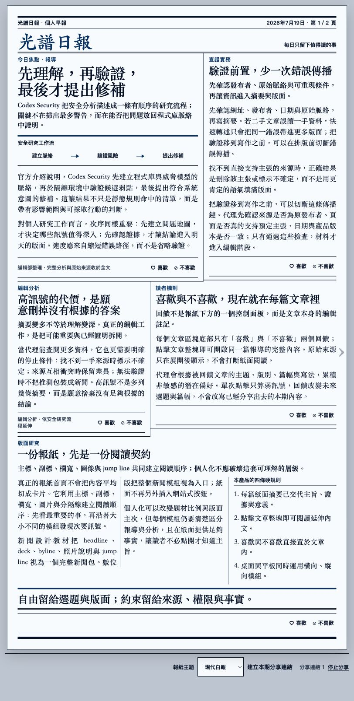
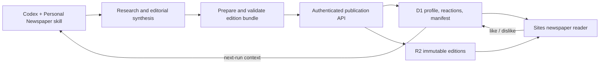

# Personal Newspaper

> A Codex-native daily newspaper that researches, edits, lays out, publishes, and improves one reader's briefing.

[](https://personal-daily-codex.takalawang.chatgpt.site/)
[](https://pnpm.io/)
[](https://nodejs.org/)
[](https://www.typescriptlang.org/)

**[Open the live edition →](https://personal-daily-codex.takalawang.chatgpt.site/)**



Personal Newspaper is a one-owner publishing system rather than a news feed. Codex gathers public reporting, checks provenance, rewrites it into a useful editorial package, and composes a dense paper-like edition. Each story is already understandable on the page; opening it reveals a deeper article and the original-source links.

## What makes it different

- **A newspaper, not a card grid.** Editions use adaptive modules, columns, rules, headlines, images, and controlled asymmetry instead of one fixed template.
- **Readable before the click.** The page carries the report's argument and evidence; article view adds context instead of repeating the same excerpt.
- **Feedback lives inside the story.** Like and dislike signals are recorded per article and influence latent topic preferences in later editions.
- **Verified publication.** The first edition must prepare, validate, publish, and pass a manifest check before Codex creates the one daily automation.
- **Immutable editions.** A delivered bundle is never silently rewritten. Recovery restores a previously published edition through an explicit compare-and-swap path.
- **Private by default.** D1 keeps the owner profile, reactions, and edition index; R2 keeps immutable edition bundles. Sharing uses revocable, non-guessable capabilities.

## How Codex and GPT-5.6 are used

Codex with GPT-5.6 was used to design, implement, test, and visually refine the product. In the running workflow it also performs the judgment-heavy editorial work: researching authoritative public sources, separating supported claims from uncertainty, synthesizing each report, selecting the daily story mix, and composing a content-driven layout instead of copying a fixed template.

The repository Skill constrains that model judgment with explicit evidence, image, layout, browser, and recovery gates. Deterministic pnpm commands own context capture, validation, publication, manifest verification, and guarded restoration. The result is one continuous Codex ecosystem loop: the Skill defines the newsroom, GPT-5.6 edits the issue, Sites makes it usable, and Schedule repeats the verified workflow each day.

## Reader journey

1. Ask Codex to use the bundled `personal-newspaper` skill.
2. Answer a short interview about masthead, language, timezone, publishing time, interests, and exclusions.
3. Codex researches and publishes the first edition, then verifies the live manifest.
4. Only after that proof succeeds, Codex installs the single daily schedule.
5. React inside articles. The next run reads those signals and adjusts topic selection, angles, and placement without rewriting past editions.

## Architecture



Key implementation areas:

- [`skills/personal-newspaper/`](skills/personal-newspaper/) — Agent Skills-compatible workflow, editorial grammar, deterministic commands, template, and evals.
- [`app/EditionReader.tsx`](app/EditionReader.tsx) — print-style edition and article reader, page turning, themes, reactions, and sharing.
- [`app/api/agent/`](app/api/agent/) — bearer-authenticated profile, context, and edition publication surface.
- [`lib/edition-store.ts`](lib/edition-store.ts) — D1/R2 persistence and publication invariants.
- [`.openai/hosting.json`](.openai/hosting.json) — Sites project and resource bindings.

## Run locally

Requires Node.js `>=22.13.0` and pnpm `10.28.0`.

```bash
pnpm install --frozen-lockfile
pnpm dev
```

## Configure your own paper

1. Deploy the Sites project and set the same secret `AUTOMATION_TOKEN` in the Sites runtime and local `.env.local`. Set local `PAPER_URL` to the deployed URL.
2. Install the bundled skill:

   ```bash
   mkdir -p ~/.codex/skills
   ln -sfn "$PWD/skills/personal-newspaper" ~/.codex/skills/personal-newspaper
   ```

3. Tell Codex: `請使用 personal-newspaper skill，幫我設定個人日報。`
4. Complete the interview. Codex publishes and verifies edition one before creating the daily automation.

Do not commit `.env.local`, context snapshots, edition drafts, or `AUTOMATION_TOKEN`.

## Prove the empty first-run flow

This test starts from no profile and no edition, then executes setup, context capture, prepare, validate, publish, and post-publish manifest verification against a temporary in-memory paper API. It never contacts production, mutates D1/R2, or creates an automation.

```bash
pnpm flow:verify-empty
```

## Operate the publication pipeline

Run these commands from the repository root. Drafts follow [`edition-template.json`](skills/personal-newspaper/assets/edition-template.json) and omit `generation`; `edition:prepare` binds the exact private context snapshot used for generation.

```bash
pnpm edition:context -- --output "$EDITION_CONTEXT" --url "$PAPER_URL"
pnpm edition:prepare -- --draft "$EDITION_DRAFT" --context "$EDITION_CONTEXT" --output "$EDITION_BUNDLE"
pnpm edition:validate -- --file "$EDITION_BUNDLE"
pnpm edition:publish -- --file "$EDITION_BUNDLE" --url "$PAPER_URL"
pnpm edition:restore -- --id "$PREVIOUS_EDITION_ID" --expected-current "$FAILED_EDITION_ID" --url "$PAPER_URL"
```

Read [`SKILL.md`](skills/personal-newspaper/SKILL.md) before operating the pipeline. The complete state machine, concurrency rules, failure handling, and automation prompt are documented in [`pipeline.md`](skills/personal-newspaper/references/pipeline.md).

## Validate a change

```bash
pnpm skill:validate
pnpm test
pnpm exec tsc --noEmit
pnpm lint
git diff --check
```

Before deployment, also validate `skills/personal-newspaper` with the official `skills-ref` validator and run the scenarios in [`evals.json`](skills/personal-newspaper/evals/evals.json).

## Design documents

- [`PRODUCT.md`](PRODUCT.md) — product boundaries and privacy model.
- [`DESIGN.md`](DESIGN.md) — reader and visual-system decisions.
- [`base-design.md`](skills/personal-newspaper/references/base-design.md) — adaptive print grammar used by Codex.
- [`edition-contract.md`](skills/personal-newspaper/references/edition-contract.md) — bundle schema and editorial contract.
