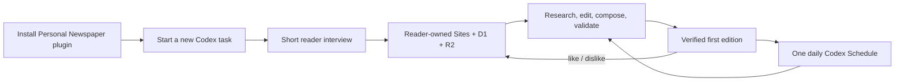

# Personal Newspaper

An installable Codex plugin that creates your own newspaper website, publishes a verified first edition, and schedules a new personalized edition every day.

It is a Skill first. The website is the publication it creates for each reader—not a shared account and not a copy of the author's newspaper.

## Quick start

1. Install the plugin:

   ```bash
   codex plugin marketplace add TakalaWang/personal-newspaper
   codex plugin add personal-newspaper@personal-newspaper
   ```

2. Restart Codex, start a new task in a new or empty project, and say:

   > Create my daily newspaper.

3. Answer the short interview. Codex creates your Sites newspaper, publishes edition one, verifies it, and then installs the daily schedule.

That is the complete reader setup. No repository clone, package command, manual hosting, database choice, or credential entry is required.

## What you get

- Your own private Sites deployment with its own D1 profile and reaction data and its own R2 edition archive.
- A dense, paper-like edition that is understandable before opening an article.
- Subject pages such as news, technology, culture, entertainment, games, and sports—not one page per story.
- Adaptive editorial composition rather than a fixed card grid or repeated template.
- Like and dislike controls inside each article package; those signals shape latent preferences for later editions.
- Detailed article views with materially deeper reporting, useful figures when evidence supports them, and original-source links only inside the detail view.
- One verified Codex Schedule that runs independently of the setup task.

## The one-time conversation

The Skill asks only for:

- masthead
- language
- timezone and publication time
- interests
- explicit exclusions
- owner email only when Codex cannot obtain it from authentication

It does not ask readers to configure layout templates, tracking topics, hosting, storage, source control, credentials, or runtime settings.

## How the product works



Codex and GPT-5.6 handle research, evidence-aware synthesis, story selection, editing, and content-derived page composition. Deterministic pnpm commands bind the exact feedback snapshot, validate the edition contract, publish immutable bundles, verify the live manifest, and guard recovery.

The first edition must be live and browser-verified before the Schedule is created. A successful publish request alone is never treated as proof.

## Newspaper contract

- The printed page carries the thesis, important facts, and enough context to understand the story.
- Opening a story adds reporting dimensions instead of repeating the same paragraph.
- Every factual paragraph is traceable to declared sources; uncertainty remains visible.
- Images remain in color, require provenance, and must explain or evidence something.
- A page is composed from today's story importance, copy measure, evidence imagery, and relationships.
- Past editions are immutable. A failed new edition can restore only its direct predecessor through a guarded compare-and-swap operation.

## Plugin structure

- [`.codex-plugin/plugin.json`](.codex-plugin/plugin.json) — Codex plugin manifest and starter prompts.
- [`skills/personal-newspaper/SKILL.md`](skills/personal-newspaper/SKILL.md) — task router, publication workflow, and canonical Schedule prompt.
- [`skills/personal-newspaper/references/first-run.md`](skills/personal-newspaper/references/first-run.md) — reader-owned Sites provisioning and scheduling gates.
- [`skills/personal-newspaper/references/pipeline.md`](skills/personal-newspaper/references/pipeline.md) — research, evidence, feedback, publication, and recovery state machine.
- [`skills/personal-newspaper/references/base-design.md`](skills/personal-newspaper/references/base-design.md) — flexible print grammar, not a named layout template.
- [`skills/personal-newspaper/evals/evals.json`](skills/personal-newspaper/evals/evals.json) — real setup, editorial, concurrency, layout, and recovery scenarios.

The Skill follows the Agent Skills open structure: `SKILL.md` contains only `name` and `description` frontmatter, keeps the main workflow concise, and links directly to one-level references and deterministic scripts.

## For contributors

Reader setup never requires these commands. They are only for developing the plugin and its bundled Sites application.

Requires Node.js `>=22.13.0` and pnpm `10.28.0`.

```bash
pnpm install --frozen-lockfile
pnpm dev
```

Validate a change:

```bash
pnpm flow:verify-empty
pnpm skill:validate
pnpm test
pnpm exec tsc --noEmit
pnpm lint
git diff --check
```

The empty-flow test uses a temporary in-memory paper API. It does not contact a deployed site, mutate D1/R2, or create a Schedule.

## Privacy and ownership

Each installation creates an isolated site and data plane. The Skill refuses to reuse the repository's example project id, URL, credential, profile, reactions, or editions. Runtime credentials are generated during setup, stored privately, ignored by source control, and never requested from the reader.

Reading is private by default. A reader may explicitly create a revocable, non-guessable share link for a complete edition; the share contains no owner profile.

## License

[MIT](LICENSE)
