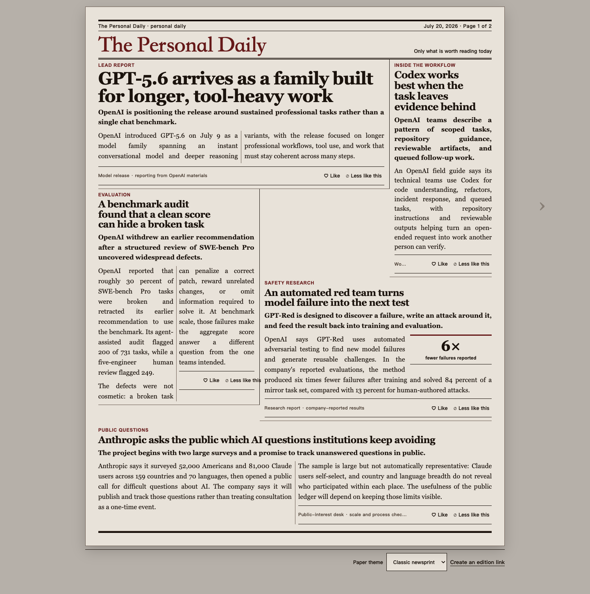
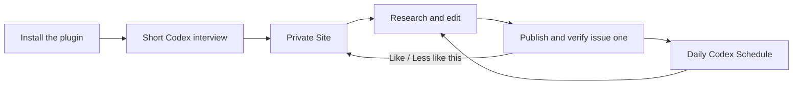

# The Personal Daily

> **You know yourself best. Codex becomes the next-best editor of what deserves your attention.**

The Personal Daily is a private newspaper that Codex researches, writes, designs, publishes, and improves for one reader. Tell Codex what matters to you, then use **Like** and **Less like this** inside the paper. Those explicit signals shape tomorrow's issue—not an opaque engagement feed and never today's already-published edition.

It is distributed as the **Personal Newspaper** Codex plugin. The website is what the plugin creates for each reader, not a shared account or a copy of the author's paper.

[](https://personal-daily-codex.takalawang.chatgpt.site/)

## Make it yours

1. Install the plugin:

   ```bash
   codex plugin marketplace add TakalaWang/personal-newspaper
   codex plugin add personal-newspaper@personal-newspaper
   ```

2. Restart Codex, start a new task in a new or empty project, and say:

   > Create my daily newspaper.

3. Answer a short interview about your interests, exclusions, language, timezone, publishing time, and masthead.

Codex then creates your private newspaper on Sites, publishes and verifies the first issue, and installs one daily Schedule. There is no repository to clone, environment file to fill in, hosting account to configure, or layout template to choose.

The [English example edition](https://personal-daily-codex.takalawang.chatgpt.site/) was created by the same pipeline. It is a product preview, not a shared installation or settings screen.

## Why Codex is the recommendation system

Most recommendation systems know clicks. Codex can work from what you deliberately tell it: the subjects you care about, what you want excluded, and why individual reports earned a **Like** or **Less like this**.

That context changes more than topic frequency. It can change reporting depth, format, section space, source mix, and placement in the next issue. Codex also researches the public web and understands the evidence behind each candidate story before deciding what deserves the page.

Each issue balances:

- **Core coverage** for established interests.
- **Adjacent coverage** that connects those interests to something useful.
- **Discovery coverage** that deliberately leaves room for surprise instead of closing the reader inside a filter bubble.

## A newspaper, not a feed

- Full, edited reports make sense on the printed page before anything is opened.
- Subject pages group news, technology, culture, entertainment, games, sports, and whatever today's reporting actually needs.
- Page composition changes with story importance, copy length, evidence imagery, and relationships instead of repeating a fixed card grid.
- Opening a report adds clearer context, additional reporting, useful figures when evidence supports them, and links to original sources.
- Like and Less like this controls live inside every article package.
- Past issues remain immutable and available in the archive.

## Private by default

Every installation creates a reader-owned Site and an isolated profile, reaction history, and edition archive. The plugin never reuses the example deployment's project, URL, credentials, profile, reactions, or issues.

Reading is private by default. A reader can explicitly create a revocable, non-guessable link for one complete issue; the shared edition contains no owner profile.

## From one conversation to every morning



The first issue must be live and browser-verified before Codex creates the Schedule. Each scheduled run snapshots the reader's latest explicit feedback, researches current public sources, compares evidence, edits original reports, composes a fresh issue, publishes it, and verifies the live result. A publish request by itself is never treated as proof.

## Built with Codex and GPT-5.6

This project was developed for **OpenAI Build Week** in the **Apps for Your Life** category.

- **Codex** helped turn the product idea into the plugin, Sites reader, publication state machine, tests, and verified deployment workflow. The most important product decisions—one reader per installation, explicit feedback instead of topic tracking, first-publish-before-scheduling, immutable issues, and a non-template page grammar—are encoded in the Skill and its test scenarios.
- **GPT-5.6** is the editorial engine used by the Skill: it performs daily research, evidence comparison, story selection, original synthesis, editing, and content-driven page composition.
- **Sites** gives each reader a durable, interactive newspaper rather than a disposable chat artifact.
- **Codex Schedule** lets the newspaper continue publishing after the setup task ends.

All project work in this repository was created during the competition period; the public commit history preserves the implementation timeline.

## Judge test path

**Supported environment:** Codex desktop with plugin marketplace and Sites access.

1. Install the plugin with the two commands in [Make it yours](#make-it-yours).
2. Start a new task in an empty project and enter `Create my daily newspaper.`
3. Complete the interview and verify that issue one opens on its generated Site.
4. Confirm that Codex creates the Schedule only after live verification succeeds.
5. Open an article, inspect its original-source links, and use an in-article reaction. The published issue must remain unchanged; the new signal belongs to the next run.

Judges do not need to rebuild the application, provide sample data, clone this repository, or enter private credentials.

## Publication contract

- The printed page carries the thesis, important facts, and enough context to understand the report.
- Opening a report adds reporting dimensions instead of repeating the same paragraph.
- Every factual paragraph is traceable to declared sources; uncertainty remains visible.
- Images remain in color, require provenance, and must explain or evidence something.
- A page is composed from today's editorial material instead of a named layout template.
- A failed new issue can restore only its direct predecessor through a guarded compare-and-swap operation.

## Plugin structure

- [`.codex-plugin/plugin.json`](.codex-plugin/plugin.json) — plugin identity and starter prompts.
- [`skills/personal-newspaper/SKILL.md`](skills/personal-newspaper/SKILL.md) — task router, publication workflow, and canonical Schedule prompt.
- [`skills/personal-newspaper/references/first-run.md`](skills/personal-newspaper/references/first-run.md) — reader-owned Sites provisioning and scheduling gates.
- [`skills/personal-newspaper/references/pipeline.md`](skills/personal-newspaper/references/pipeline.md) — research, evidence, feedback, publication, and recovery state machine.
- [`skills/personal-newspaper/references/base-design.md`](skills/personal-newspaper/references/base-design.md) — flexible print grammar rather than a fixed template.
- [`skills/personal-newspaper/evals/evals.json`](skills/personal-newspaper/evals/evals.json) — setup, editorial, concurrency, layout, and recovery scenarios.

The Skill follows the Agent Skills open structure: `SKILL.md` contains only `name` and `description` frontmatter, keeps the main workflow concise, and links directly to one-level references and deterministic scripts.

## Contributing

Reader setup never requires these commands. They are only for developing the plugin and its bundled Sites application.

Requires Node.js `>=22.13.0` and pnpm `10.28.0`.

```bash
pnpm install --frozen-lockfile
pnpm dev
```

Validate a change:

```bash
pnpm flow:verify-empty
pnpm skill:validate
pnpm test
pnpm exec tsc --noEmit --incremental false
pnpm lint
git diff --check
```

The empty-flow test uses a temporary in-memory paper API. It never contacts a deployed Site, mutates stored reader data, or creates a Schedule.

## License

[MIT](LICENSE)
